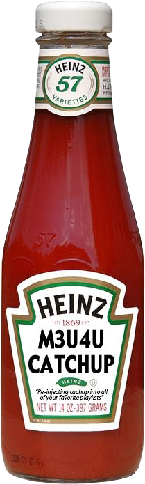

# m3u4u.com catchup attributes re-injection script

**This script will re-inject catchup properties into an m3u4u.com based playlist if these attributes existed in the original source playlist.**

Please consider [donating](https://paypal.me/djouija) to support this project. Thanks!

## Notes

-   Requires server/hosting with PHP
-   Update `$originalPlaylistUrl` variable with the URL of the original source m3u playlist with the catchup attributes present
-   Update `$modifiedPlaylistUrl` variable with the URL of the m3u4u.com based playlist
-   Use the URL location where this PHP script is hosted as your new playlist URL in your application of choice _(or just open the URL to this script)_ and an updated playlist will be generated that contains the catchup attributes for all streams/channels where these were present in the original playlist URL!
